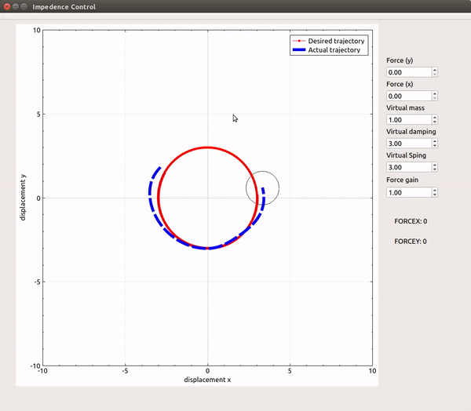

# Impedence Control


## Simulation
* It's required Qt version greater than 5.9. 


## Kinematics (Simple Harmonic Motion)


Assuming that the angular velocity and the radius of the SHM system is constant.

Boundary Conditions

```
    omega = 1;        //angular velocity
    posx = 3*cos(0);  //init x y
    posy = 3*sin(0);
    posx2 = 3*cos(0);
    posy2 = 3*sin(0);

    theta = atan2(posy,posx); //init theta
    forcex = 0;               //init force
    forcey = 0;  
    v_x = 0;                  //init vx
    v_y = omega * 3 * cos(theta);
    vx_2 = 0;			//init vx2
    vy_2 = omega * 3 * cos(theta);
    
    mass =1;                  //virtual mass
    damping=0.5;
    spring =3.0;
    force_gain = 1.0;
    interaction_time = 0.5;

```


Update Rules
```
theta = atan2(y,x);

x = r * cos(theta)

y = r * sin(theta) 

vx =  - omega * r * sin(theta)

vy =  omega *r *cos(theta)

ax = - omega *omega *r * cos(theta)

ay = -omega * omega *r *sin(theta)


//impedance Control
ax_2 = ax_d + (1 / mass) * ( damping * (v_xd - vx_2 ) + spring* (posx_d - posx2 ) +forcex);

ay_2 = ay_d + (1 / mass) * ( damping * (v_yd - vy_2 ) + spring* (posy_d - posy2 ) +forcey);

``` 


## Impedence Control design
 
ax_2 = ax_d + (1 / mass) * ( damping * (v_xd - vx_2 ) + spring* (posx_d - posx2 ) +forcex);

ay_2 = ay_d + (1 / mass) * ( damping * (v_yd - vy_2 ) + spring* (posy_d - posy2 ) +forcey);
 


## Explaination





